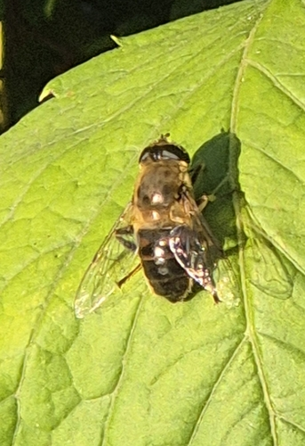

# Acknowledgements 

```{r setup}
#| echo: false
#| warning: false
#| message: false
#| results: hide
here::i_am("atlas-mnhnl.Rproj")
source(here::here("Atlas", "code", "0_Initialisation.R"))
source(here::here("Atlas", "code", "9_LastSpecies.R"), local=FALSE)
```

## Observer names

```{r}
#| echo: false
#| results: asis
#| warning: false
MD$Origin <- ifelse(
  startsWith(as.character(MD$Observation_Key), "INAT_") | startsWith(as.character(MD$Observation_Key), "oOrg_"),
  "Citizen science", "Other"
)
recorder_counts <- sort(table(MD$Recorders), decreasing = TRUE)
top50 <- names(head(recorder_counts, 50))
print_recorder_list <- function(data) {
  all_recorders <- sort(na.omit(unique(data$Recorders)))
  formatted <- ifelse(all_recorders %in% top50,
                       paste0("**", all_recorders, "**"),
                       all_recorders)
  cat(paste(formatted, collapse = ", "))
}
cat("### Citizen science (iNaturalist & Observation.org)\n\n")
print_recorder_list(MD[MD$Origin == "Citizen science", ])
cat("\n\n### Other sources\n\n")
print_recorder_list(MD[MD$Origin == "Other", ])
```
```{=html}
<div id="img-modal">
  <span class="close-btn" onclick="closeLightbox()">&times;</span>
  
</div>

<script>
document.addEventListener("DOMContentLoaded", function() {
  document.querySelectorAll(".lightbox img").forEach(function(img) {
    img.addEventListener("click", function() {
      document.getElementById("img-modal-content").src = this.src;
      document.getElementById("img-modal").classList.add("active");
    });
  });
});

document.addEventListener("click", function(e) {
  if (e.target.id === "img-modal") closeLightbox();
});
document.addEventListener("keydown", function(e) {
  if (e.key === "Escape") closeLightbox();
});

function closeLightbox() {
  document.getElementById("img-modal").classList.remove("active");
}
</script>
```


## Last `r taxon` recorded (iNaturalist)

::: {.lightbox}

{width=70% fig-align="center" fig-pos="H"}
::: 

```{r}
#| echo: false
#| results: asis
cat(paste0("*", species, "*\\\n"))
cat(paste0(obs_license, "\\\n"))
cat(paste0(obs, "\\\n\n"))
cat(paste0("[View observation](", obs_url, ")"))
```
