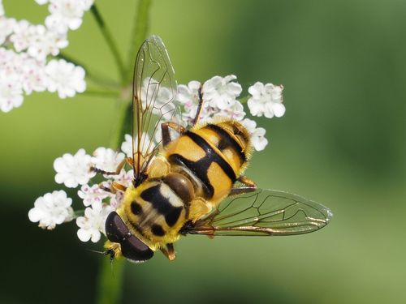

---
include-in-header:
  - text: |
      <style>
      #title-block-header .title{
          text-align:center;
          font-size:3rem;
          font-style:italic;
          font-family:Georgia, "Times New Roman", serif;
          color:#000;
      }
      </style>
---

# Myathropa florea

::: {.species-common-names}
**EN** &nbsp;   Yellow-haired Sun Fly <br>
**LB** &nbsp;   Batmanschwiefmecke<br>
**FR** &nbsp;   Éristale des fleurs<br>
**DE** &nbsp;   Totenkopfschwebfliege<br>
**PT** &nbsp;   Mosca-zangão amarela
:::


## Conservation status
::: {.columns}

::: {.column width="50%"}

### Europe


::: 

::: {.column width="50%"}

{.iucn}


:::

:::

::: {.columns}

::: {.column width="50%"}


### European Union (27)

::: 

::: {.column width="50%"}

{.iucn}

:::

:::

::: {.columns}

::: {.column width="50%"}


### Luxembourg (preliminary)
::: 

::: {.column width="50%"}

{.iucn}

:::

:::


{.species-photo}

<!-- ## Activity period -->


<!-- ::: {.columns} -->

<!-- ::: {.column width="50%"} -->
<!-- ```{r g1} -->
<!-- #| echo: false -->
<!-- #| warning: false -->
<!-- #| message: false -->


<!-- source("code/1_config.R") -->
<!-- source("code/2_LoadBorders.R") -->
<!-- source("code/3_LoadData.R") -->
<!-- source("code/6_PresenceMois.R") -->

<!-- gSource -->
<!-- ``` -->
<!-- :::  -->

<!-- ::: {.column width="50%"} -->
<!-- ```{r g2} -->
<!-- #| echo: false -->
<!-- #| warning: false -->
<!-- #| message: false -->
<!-- #| results: 'hide' -->


<!-- source("code/1_config.R") -->
<!-- source("code/2_LoadBorders.R") -->
<!-- source("code/3_LoadData.R") -->
<!-- source("code/6_PresenceMois.R") -->

<!-- g2 -->
<!-- ``` -->
<!-- ::: -->

<!-- ::: -->


<!-- ## Description -->

<!-- ## Habitat -->

<!-- ### Immature -->

<!-- ### Mature -->


<!-- ## Distribution -->

<!-- ### National -->


<!-- ```{r m3} -->
<!-- #| echo: false -->
<!-- #| warning: false -->
<!-- #| message: false -->


<!-- source("code/1_config.R") -->
<!-- source("code/utils.R") -->
<!-- source("code/2_LoadBorders.R") -->
<!-- source("code/3_LoadData.R") -->
<!-- source("code/4_MainMap.R") -->
<!-- source("code/5_SpeciesMaps.R") -->

<!-- m3@map -->
<!-- ``` -->

